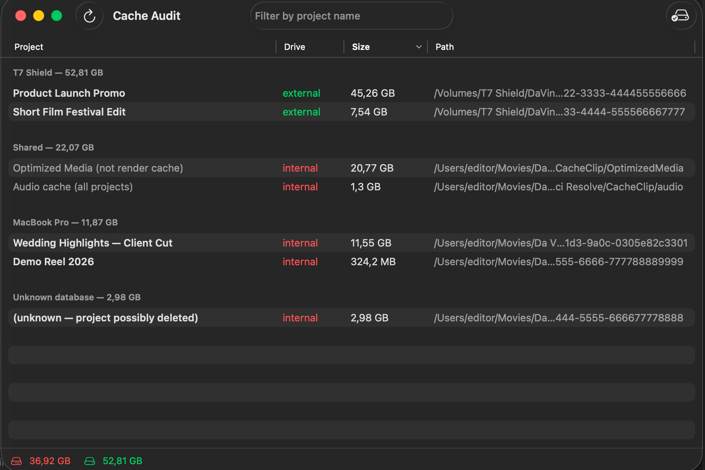

# DaVinci Resolve — Cache Audit

A macOS tool that shows which project's cache is eating up which drive, and
how much — render cache, Optimized Media, and audio cache together,
including cache left behind by projects that no longer exist in your
library.

Resolve's cache (`CacheClip`) stores every cached clip in a folder named
after an opaque UUID, e.g. `eee02c2c-325d-460f-9aeb-0e28aac8b45f`. If
you've got multiple disk databases spread across your internal drive and
several external drives, you end up with dozens of anonymous UUID folders.

## How this compares to Resolve's own Cache Manager

Resolve isn't blind to this — since **18.5**, `Playback → Delete Render
Cache → Manage Cache Data` gives you a genuinely useful cross-project,
cross-library view of **render cache**: project name, location, and size,
sortable, across every library Resolve can see. For render cache alone,
that native tool already solves a lot of the "whose is this UUID folder"
problem.

What it doesn't do:

- **Optimized Media and audio cache** can be deleted from Resolve
  (`Playback → Delete Optimized Media`, or by hand), but — unlike render
  cache — Resolve doesn't show you which project or files that data
  belongs to before you delete it. This tool maps all three cache types
  (render, Optimized Media, audio) back to project names the same way.
- **Orphaned cache** — a UUID folder left behind by a project you deleted
  from your library — has nothing to select in Resolve's cache manager,
  since there's no project entry left to attach it to. This tool still
  finds it via the `Info.txt` Resolve wrote next to the cache files
  themselves (see below), and flags it as "possibly deleted."
- Resolve's own cache manager deletes immediately, with **no warning
  dialog or undo**. The native app version of this tool (below) moves
  cache to Trash instead — recoverable if you pick the wrong thing.
- This tool also works without opening Resolve at all — useful for a
  quick "how much space is this actually using" check.

## How it maps cache back to projects

No SQL table needed. Every UUID folder directly under a `CacheClip`
directory contains a plain-text `Info.txt` file:

```
Database Name: X9Pro
User Name: guest
Project Name: My Project Name
```

That's it — Resolve writes its own UUID→project mapping right next to the
cache files. No SQLite parsing, no BLOB-column headaches. This tool just
reads those files.

## What the script does

1. Scans your home folder and every mounted volume for Resolve disk
   databases (`Resolve Projects`) and render-cache folders (`CacheClip`) —
   automatically, without any hardcoded paths or drive names.
2. Reads each UUID folder's `Info.txt` to resolve it to a project name and
   database name.
3. Measures the actual disk usage of each project's cache.
4. Determines whether that cache lives on an internal or external drive
   (via `diskutil`, not path guessing).
5. Prints one sorted table: project → drive → size → path — largest first.
6. As a bonus, also lists each project's *configured* cache path (from
   `SM_UserSetup.CachePath` in `Project.db`), so you can spot projects
   pointing at a drive that's no longer connected.

Nested/duplicate `CacheClip` folders (a common manual-setup mistake) are
detected and skipped automatically: a `CacheClip` folder only counts if it
directly contains UUID folders or the shared `audio`/`OptimizedMedia`
folders — a folder that only contains another folder called `CacheClip` is
treated as a wrapper and ignored.

## Example output

```
Part 1 — Cache usage per project, sorted by size

  Project                                     Drive      Size  Path
  ──────────────────────────────────────────  ────────  ────────  ────
  Feature Film Rough Cut                       external  48.4 GB  /Volumes/Drive2/DaVinci/CacheClip/CacheClip/eee02c2c-...
  Optimized Media (not render cache)           internal  22.3 GB  /Users/you/Movies/Da Vinci Resolve/CacheClip/OptimizedMedia
  Audio cache (all projects)                   external   5.0 GB  /Volumes/Drive2/DaVinci/CacheClip/CacheClip/audio
  Corporate Video Edit                         external   1.2 GB  /Volumes/Drive2/DaVinci/CacheClip/CacheClip/d47c9bdd-...
  ...

  Total internal: 23.7 GB
  Total external: 56.0 GB
```

## Requirements

- macOS (uses `diskutil`, `sqlite3` — both built in, no install needed)
- DaVinci Resolve using a **Disk Database** project library. If you use
  Resolve's default cloud/Postgres project library instead, there's no
  `Resolve Projects` folder for this tool to find, and Part 2 will simply
  report nothing — Part 1 (the CacheClip scan) still works either way,
  since the cache folder structure is the same.

## Native app



`CacheAudit/` contains a native macOS app (SwiftUI) that does the same scan
in a window instead of a terminal, and adds one capability the script
doesn't have: selecting cache entries and moving them to Trash (never a
hard delete) directly from the dashboard. It also shows the same
configured-cache-path table as Part 2 below, grouped by disk database when
you have more than one.

**Download:** grab `Cache Audit.app` from the
[Releases](../../releases) page, open the DMG, and drag it into
Applications.

**Build from source:** open `CacheAudit/CacheAudit.xcodeproj` in Xcode and
run, or `xcodegen generate` from `CacheAudit/` first if the `.xcodeproj` is
missing (`brew install xcodegen`).

### First launch (unsigned build)

This build isn't notarized by Apple (that requires a paid Apple Developer
Program membership) — it's ad-hoc signed, which is normal for a small free
tool distributed outside the App Store. macOS Gatekeeper will refuse to
open it with a plain double-click the first time. To open it once:

1. Right-click (or Control-click) `Cache Audit.app` in Applications → **Open**.
2. Click **Open** again in the dialog that appears.

After that first approval, it opens normally like any other app. This is a
one-time step per Mac — you're not disabling Gatekeeper, just approving this
one app.

## Usage

Double-click `DaVinci Cache Audit.command`. It opens Terminal, scans your
drives, and prints the report. Press any key to close the window when
you're done reading.

You can also run it from a terminal directly:

```sh
./"DaVinci Cache Audit.command"
```

**First run on a large or sleeping external drive can take a while** — the
size calculation has to actually walk the cache folder, and macOS often
kicks off Spotlight indexing right after touching thousands of small cache
files on an external drive. The tool prints progress lines while it works
so a slow run doesn't look frozen.

## Safety

This tool is **read-only**. It never deletes or modifies anything — it only
runs `find`, `du`, and read-only `SELECT` queries. It's safe to run at any
time, including while Resolve is open.

To actually clear render cache, don't delete these folders by hand — close
Resolve first if you do, or better yet use Resolve's own tool:
**Playback → Delete Render Cache → All**.

## License

MIT — see [LICENSE](LICENSE).
